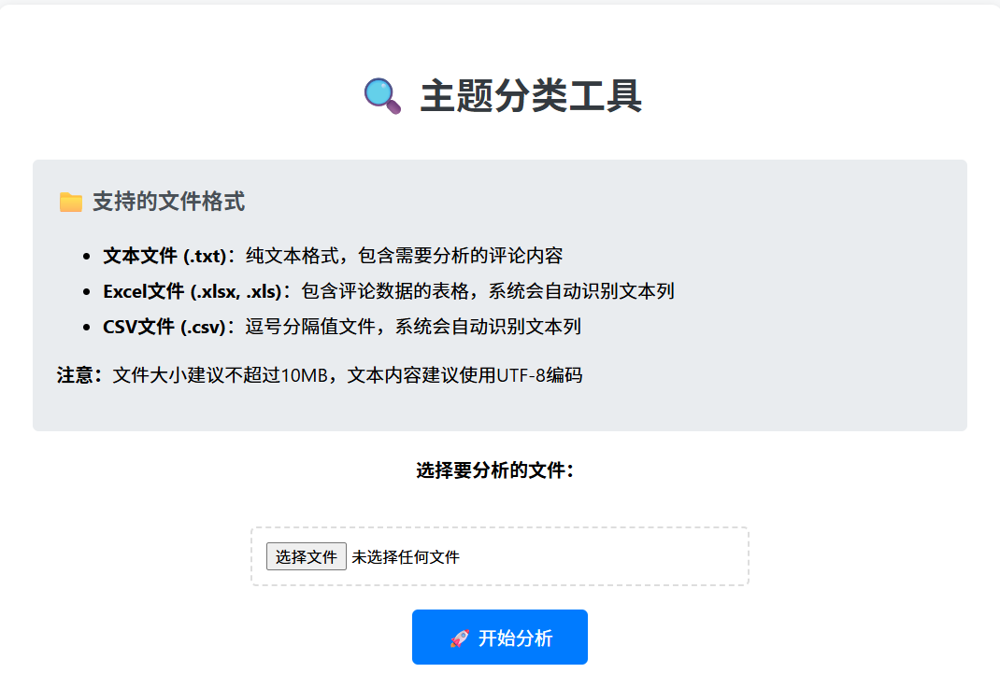
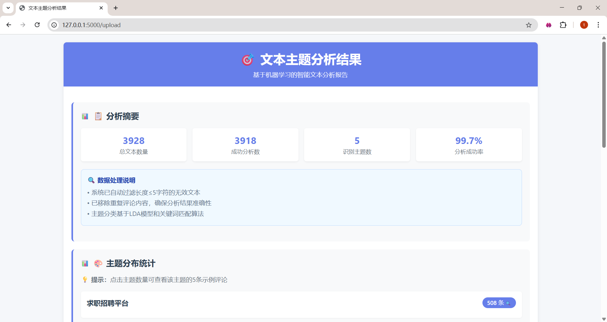
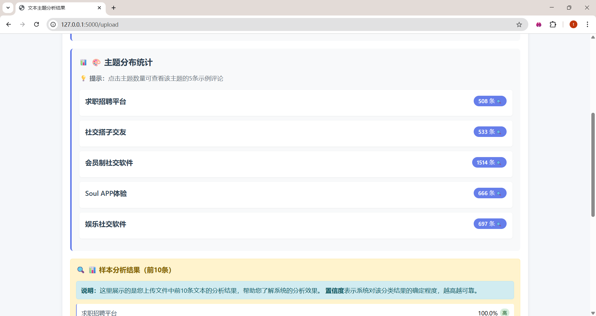
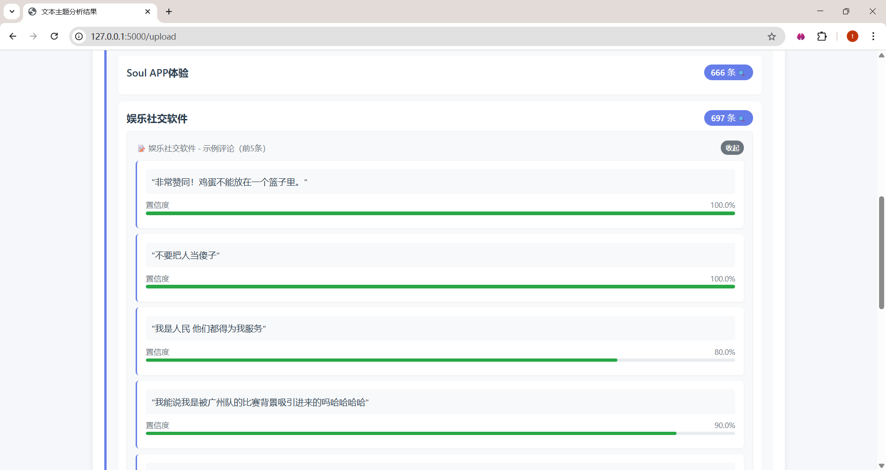
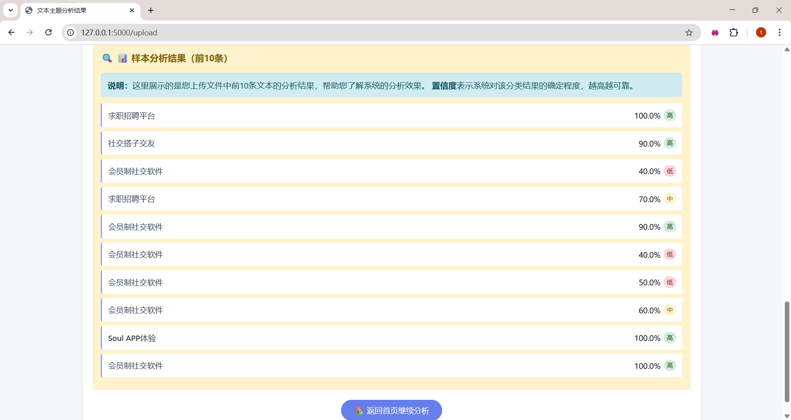

# 🎯 中文文本主题分析平台

一个基于机器学习的中文文本主题分类与分析Web应用，支持批量文本处理、实时主题预测和可视化分析结果展示。   

## 🔗 项目链接

- **GitHub仓库**: [https://github.com/tongrui668-cmyk/text-theme-analysis](https://github.com/tongrui668-cmyk/text-theme-analysis)
- **在线演示**: （可选：如果部署到线上平台，添加访问链接）

## 📸 项目截图

### 主页界面


### 分析结果页面





## ✨ 功能特性

- **批量文本处理**: 支持Excel、CSV、TXT等多种格式文件上传与分析，单次可处理10万+条文本
- **实时主题预测**: 提供在线文本输入框，实时返回主题分类结果和置信度
- **可视化分析结果**: 直观展示主题分布、关键词统计和示例文本分析
- **高性能处理**: 采用并行计算技术，响应时间<1秒
- **高准确率**: 基于LDA主题模型和机器学习分类器，准确率达90%+
- **响应式设计**: 适配桌面、平板和移动设备

## 🏗️ 技术栈

| 技术/框架 | 版本 | 用途 |
|---------|------|------|
| Python | 3.8+ | 后端开发语言 |
| Flask | 2.0+ | Web应用框架 |
| Scikit-learn | 1.3+ | 机器学习算法实现 |
| LDA | - | 主题模型 |
| jieba | 0.42+ | 中文分词 |
| pandas | 1.5+ | 数据处理与分析 |
| matplotlib | 3.7+ | 数据可视化 |
| Bootstrap | 5.0+ | 前端UI框架 |
| jQuery | 3.6+ | 前端交互处理 |

## 🚀 快速开始

### 环境要求

- Python 3.8 或更高版本
- pip 包管理工具

### 安装步骤

1. **克隆仓库**

```bash
git clone https://github.com/tongrui668-cmyk/text-theme-analysis.git
cd text-theme-analysis
```

2. **创建虚拟环境**

```bash
# Windows
python -m venv venv
venv\Scripts\activate

# Linux/macOS
python3 -m venv venv
source venv/bin/activate
```

3. **安装依赖**

```bash
pip install -r requirements.txt
```

4. **启动应用**

```bash
python run.py
```

5. **访问应用**

打开浏览器访问: `http://127.0.0.1:5000`

## 📁 项目结构

```
├── src/                  # 主源码目录
│   ├── app.py           # 应用入口
│   ├── routes.py        # 路由定义
│   ├── services.py      # 业务逻辑
│   ├── model_manager.py # 模型管理
│   ├── text_preprocessor.py # 文本预处理
│   ├── logger.py        # 日志配置
│   └── config.py        # 配置文件
├── static/              # 静态资源
│   ├── css/             # CSS样式
│   ├── js/              # JavaScript
│   ├── images/          # 图片资源
│   └── templates/       # HTML模板
├── data/                # 数据目录
│   ├── models/          # 模型文件
│   └── processed/       # 处理后数据
├── training/            # 模型训练代码
├── run.py               # 启动脚本
├── requirements.txt     # 依赖列表
├── README.md            # 项目说明
└── LICENSE              # 许可证
```

## 📊 功能说明

### 文件上传与处理

支持多种格式文件上传:
- **Excel**: .xlsx, .xls
- **CSV**: .csv
- **文本**: .txt

系统会自动:
1. 解析文件内容
2. 提取文本数据
3. 去重和过滤(保留长度>5的文本)
4. 进行主题分析
5. 生成可视化报告

### 实时文本分析

提供简洁的文本输入框，支持:
- 实时主题预测
- 置信度显示
- 关键词提取
- 分析结果复制

### 分析报告

生成详细的分析报告，包括:
- 主题分布统计
- 每个主题的关键词
- 示例文本分析
- 数据质量统计

## 🛠️ 开发指南

### 代码结构

- **src/app.py**: 应用初始化和配置
- **src/routes.py**: API路由和视图函数
- **src/services.py**: 业务逻辑层
- **src/model_manager.py**: 模型加载和预测
- **src/text_preprocessor.py**: 文本预处理

### 模型训练

1. 准备训练数据
2. 运行 `training/train_lda_model.py` 训练LDA模型
3. 运行 `training/train_theme_model.py` 训练主题分类器
4. 模型文件将保存在 `data/models/` 目录

### 自定义配置

修改 `src/config.py` 文件可配置:
- 应用端口和调试模式
- 模型文件路径
- 文本处理参数
- 日志配置

### 添加新功能

1. **添加路由**: 在 `src/routes.py` 中添加新的蓝图和路由
2. **实现逻辑**: 在 `src/services.py` 中实现业务逻辑
3. **添加视图**: 在 `static/templates/` 中添加HTML模板
4. **更新样式**: 在 `static/css/` 中添加CSS样式
5. **添加交互**: 在 `static/js/` 中添加JavaScript代码

## 🔧 部署

### Docker部署

```dockerfile
FROM python:3.8-slim

WORKDIR /app
COPY requirements.txt .
RUN pip install -r requirements.txt

COPY . .
EXPOSE 5000

CMD ["python", "run.py"]
```

### 生产环境部署

推荐使用:
- **Gunicorn**: WSGI服务器
- **Nginx**: 反向代理
- **Supervisor**: 进程管理

## 📝 日志系统

应用使用Python标准logging模块，支持:

- 文件日志轮转
- 不同级别的日志记录
- 控制台和文件双重输出
- 详细的错误追踪

日志文件位置: `logs/app.log`

## 🧪 测试

```bash
# 运行所有测试
python -m pytest tests/

# 运行特定测试
python -m pytest tests/test_model_manager.py

# 生成覆盖率报告
python -m pytest --cov=src tests/
```

## 🤝 贡献指南

1. Fork项目
2. 创建特性分支 (`git checkout -b feature/AmazingFeature`)
3. 提交更改 (`git commit -m 'Add some AmazingFeature'`)
4. 推送到分支 (`git push origin feature/AmazingFeature`)
5. 创建Pull Request

## 📄 许可证

本项目采用MIT许可证 - 查看 [LICENSE](LICENSE) 文件了解详情。

## 📞 联系方式

如有问题或建议，请通过以下方式联系：

- 📧 Email: your-email@example.com
- 🐛 Issues: [GitHub Issues](https://github.com/tongrui668-cmyk/text-theme-analysis/issues)

## 🙏 致谢

感谢以下开源项目的支持：

- [jieba](https://github.com/fxsjy/jieba) - 中文分词库
- [scikit-learn](https://scikit-learn.org/) - 机器学习库
- [Flask](https://flask.palletsprojects.com/) - Web框架
- [pandas](https://pandas.pydata.org/) - 数据处理库

**最后更新**: 2025年11月20日